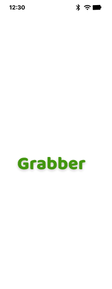
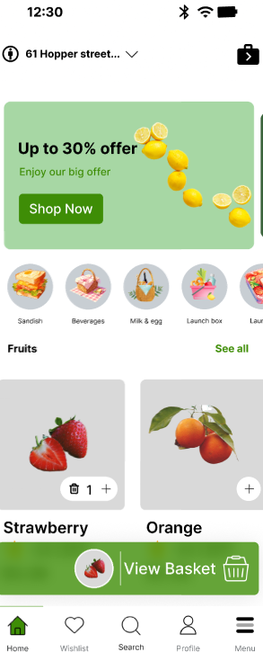
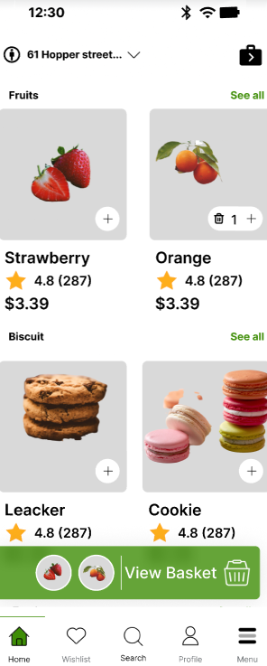
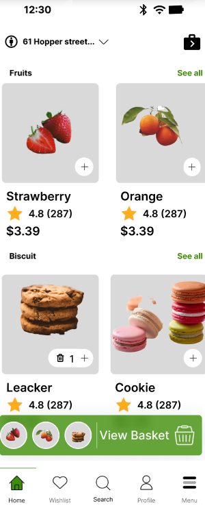
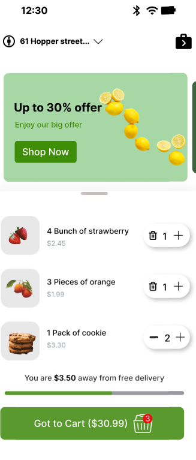
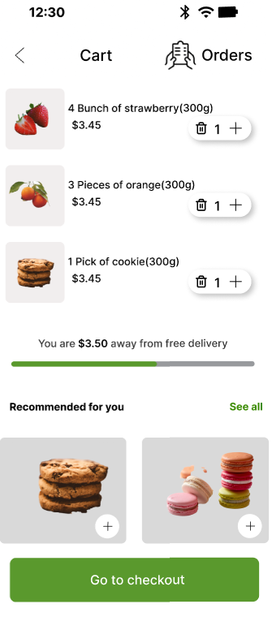

# grocery-app-figma

# 🍓 Grocery Mobile App UI

This project is a mobile UI design for a grocery shopping app. It includes product listings, categories, ratings, and a fixed "View Basket" bar at the bottom.

📽️ [Watch the demo video on Google Drive](https://drive.google.com/file/d/1CHUpreM_o3rrDEjqw_BB6D6UVbA-WYfX/view?usp=drive_link)

## 📹 Video Demo (Try another way)
[Watch the preview](VideoClip.MOV)

## 📸 Preview

## 📁 Features

- Fixed "View Basket" bar
- Scrollable product list
- Product ratings, prices, and images
- Categories like Fruits and Biscuits
- Responsive layout for mobile screens

## 🛠 Tools Used

- Figma
- Mobile Frame (iPhone Mockup)
- Auto Layout & Constraints

## 📎 Live Figma Design

[Figma Project Link](https://www.figma.com/design/0MPzivObRQhXLQ899BBRYI/Figma-First-Project?node-id=62-2&t=8Gx9V1dQCxPRU4Ga-1)
