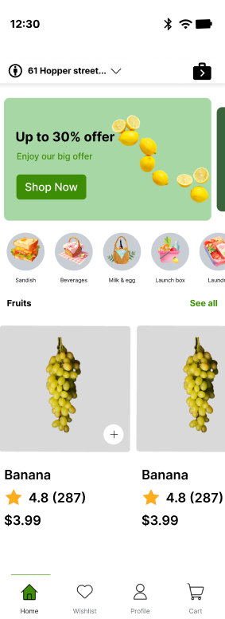

# grocery-app-figma

# 🛍️ Grocery Shopping App UI - Figma First Project

This project is a mobile UI design for a grocery shopping application. It was designed using **Figma** to practice building clean, modern, and functional interfaces for e-commerce apps.

🔗 **[View Figma File](https://www.figma.com/design/0MPzivObRQhXLQ899BBRYI/Figma-First-Project?node-id=257-176&t=yMV0BTMpQvisinwO-1)**

---

## 📱 Home Screen Preview

---

## 🧩 Features

- 🍋 **Promotional Banner** – "Up to 30% offer" with a bold call-to-action button.
- 🍱 **Category Scroll** – Quick access to categories like Sandwich, Beverages, Milk & Egg, Lunch Box.
- 🍌 **Fruit Listings** – Includes product image, name, rating, price, and add-to-cart button.
- ⭐ **User Ratings** – Star-based rating system to show product reviews.
- 🛒 **Bottom Navigation Bar** – Home, Wishlist, Profile, and Cart.

---

## 📂 Sections

### 1. Header
- Displays user’s selected delivery location.
- Notification/cart icon at top-right.

### 2. Promotion Area
- Engaging banner with lemons and “Shop Now” button.

### 3. Category Navigation
- Horizontally scrollable category icons.

### 4. Fruits Section
- Product cards for bananas.
- Price: `$3.99`
- Rating: `4.8` from 287 reviews.

### 5. Bottom Navigation
- Navigation icons for key app sections.

---

## 📌 How to Use

1. Open the Figma link.
2. Duplicate the project to your workspace.
3. Customize UI elements, colors, or content as needed.
4. Use it as a prototype or base for development.

---

## ✨ About This Project

This is a beginner-friendly UI design created to learn mobile app interfaces using **Figma**. It focuses on essential UI elements for a shopping app like product listings, categories, and offers.

---

## 📧 Contact

For feedback or questions, feel free to reach out!

---

